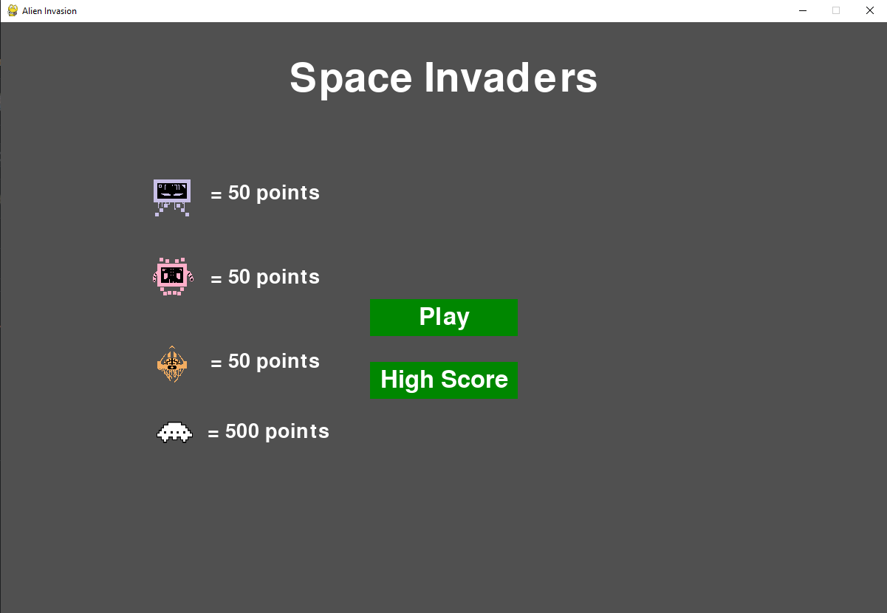
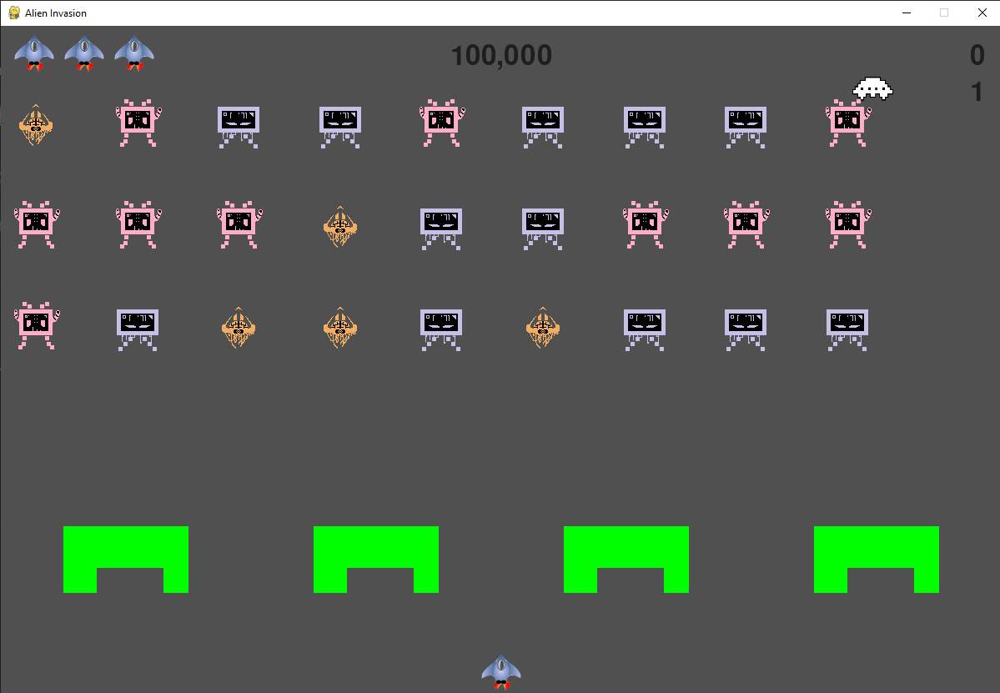

# Space Invaders Game

Done as a project for a game development class.  
Here is a link to a short video demonstrating the gameplay.  
  https://youtu.be/DEtEX3qx4WI?si=hIid60ggf_bwDg02

# Home Screen

  Here is what the homescreen looks like.
  You can press play to play the game, or press the high score button to see what the current high score is.
  Each new high score will be recorded on disk and can be manually editted or deleted.
  You can also see the points of the aliens that appear within the game.

# Playing the Game

Now that you have the pressed the play button, here's how the game works.
You can move around using your ARROW KEYS. Pressing SPACE will also shoot a laser.
You can damage the aliens as well as your defense bunkers. The aliens will
also shoot back occasionally, so be careful! Sometimes, a UFO will also fly past.
If you can hit it, you'll get 500 points! You have 3 lives. Try to get the highest score
possible! The top right shows your score while the middle top shows the current high score.
Good luck!

